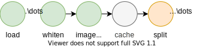

Caching
=======

The library provides a mechanism that can be used to store the results of a series of transforms on a dataset.
By loading the cached value rather than applying the transformations again the dataset can in many cases be loaded in a fraction of the time.

   Caching operator. The results of operations before the cache operator are stored for fast retrieval.
   Only the operations after the cache are computed during execution.

Cache Operator
--------------

To cache some combination of dataset and transformations the *cache* function is called on the dataset.

.. doctest::

    >>> kernel = np.ones((5,5))*(5**2)
    >>> train, val = do.load_mnist().whiten().image_filter(kernel).cache().split((0.7,0.3))
    >>> # TODO
    False

The library keeps track of what values are available in the cache and ensures that the cache is recalculated when necessary.
For example the cache will be updated when a new operation is introduced before the cache operator, or when the parameters of one or more transforms are modified.

Clearing The Cache
------------------
The cached values are stored in the `.datasetopts_cache` in the working directory.
To ensure that the size of the cache does not grow indefinitely it is possible to define when it should be cleared or to clear it manually.

.. doctest::

    >>> do.set_caching_cleanup_strategy("clean_unused")
    >>> do.set_caching_cleanup_strategy("never")
    >>> do.clear_cache()
    >>> #TODO
    False