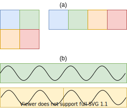
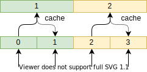

Transforms
==========

Ordering
--------

Shuffle
~~~~~~~
Shuffles a dataset such that samples are returned in random order when read.

.. doctest::

    >>> ds_shuffled = ds_mnist.shuffle(seed=0)
    >>> ds_mnist[0] == ds_mnist[0]
    True
    >>> ds_mnist[0] == ds_shuffled[0]
    False

Split
~~~~~
Divides a dataset into several smaller sets, each containing a specific fraction of all samples.
This may be used for creating a training and validation split.

.. doctest::

    >>> train, val = ds_mnist.split([0.5,0.5])
    >>> len(train) == len(ds_mnist)/2
    True
    >>> len(val) == len(ds_mnist)/2
    True

Split Filter
~~~~~~~~~~~~
Splits the dataset based on a predicate evaluated on each sample.
For example the MNIST dataset may be split into the samples corresponding to zero and all others.

.. doctest::

    >>> def func(s):
    >>>     return s.lbl == 0
    >>>
    >>> zeros, others = ds_mnist.split_filter(func)
    >>> all([s.lbl == 0 for s in zeros])
    True

Changing Data
-------------

Transform
~~~~~~~~~
Applies an user defined transform to each sample of a dataset.
The function must take an sample as argument and in turn return a new sample.

.. doctest::

    >>> def func1(s):
    >>>     img, lbl = s
    >>>     img += np.Random.randn(img.shape)
    >>>     return (img,lbl)
    >>> 
    >>> def func2(img):
    >>>     return img + np.Random.randn(img.shape)
    >>>
    >>> ds1 = ds_mnist.transform(func1)
    >>> ds2 = ds_mnist.transform("img",func2)
    True

.. _tf_subsample:

Subsample
~~~~~~~~~
For some applications it may be useful to convert each sample into several smaller sub-samples.
For example, a sample may be a time-series stretching over a large time interval, which needs to be split into several series of shorter length.
Likewise a single image can be split into sub images. Both scenarios are depicted in :numref:`fig_subsample`. 

.. _fig_subsample:

   Subsampling of image (a) and subsampling of time-series (b)

To subsample a dataset the :func:`subsample <datasetops.dataset.subsample>` method is called with a function that describes
how each sample should be divided. This function must return an iterable consisting of the new samples as seen below:

.. doctest::

    >>> def func(s):
    >>>     return (s,s)
    >>>
    >>> len(ds_mnist)
    70000
    >>> ds = ds_mnist.subsample(func, n_samples=2)
    >>> len(ds)
    140000

The method requires that user to specify the number of sub-samples produces by each sample.
This is necessary to ensure that the operation can be evaluated lazily, without first having to apply the function to every sample of the dataset.

.. The difference between the :meth:`transform <datasetops.dataset.Dataset.transform>` and :func:`subsample <datasetops.dataset.subsample>` methods, 
.. is that the former modifies the sample itself, but not the number of samples, whereas the latter is allowed to do both.

To reduce the amount of unnecessary reads from the dataset being sub-sampled, it is possible to enable different caching strategies.
Consider the example shown below, where each sample of the original dataset is subsampled to produces two new samples.

.. _fig_subsample_caching:

   Caching modes of the subsample operation.

.. doctest::

    >>> cnt = 0
    >>> def func(s):
    >>>     nonlocal cnt
    >>>     cnt += 1
    >>>     return (s,s)
    >>> 
    >>> ds = ds_mnist.subsample(func, n_samples=2, cache=None)
    >>> ds[0]
    >>> ds[1]
    >>> cnt
    2
    >>> cnt = 0
    >>> ds_cache = ds_mnist.subsample(func, n_samples=2, cache="block")
    >>> ds[0]
    >>> ds[1]
    >>> cnt
    1

These should not be confused by the more general caching mechanism described in the section on :ref:`caching <sec_caching>`.

Supersample
~~~~~~~~~~~
This :func:`supersample <datasetops.dataset.supersample>` transform can be used to combine several samples into fewer, but larger samples.
The transform can be seen as the inverse of :ref:`subsample <tf_subsample>`.

>>> def sum(s):
>>>     return (s(0) + s(1))
>>> ds = do.from_iterable([1,2,3,4,5,6])
>>> ds.supersample(sum, n_samples=2)
>>> list(ds)
[(3),(7),(11)]

Images Manipulation
-------------------

Convolves the images in the dataset with the specified filter.

.. doctest::

    >>> kernel = np.ones((5,5))/(5*5)
    >>> do.load_mnist().image_filter(kernel)
    TODO

Resize
~~~~~~
Resize the images of the dataset to a specified size.

    >>> do.load_mnist().resize((10,10))
    >>> s = next(do)
    >>> assert np.shape(s.image) == (10,10)

Normalize
~~~~~~~~~

Rotate
~~~~~~

Time-Series
-----------

Window
~~~~~~

Interpolate
~~~~~~~~~~~

